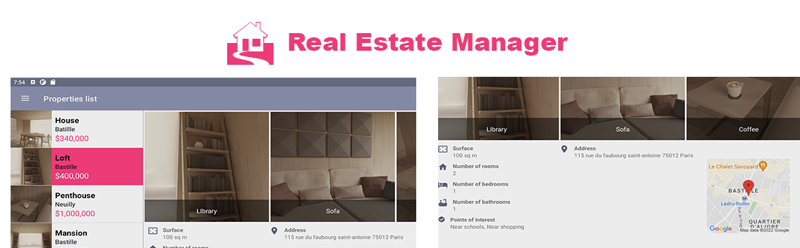

# Real Estate Manager
Real Estate Manager is an application that makes it easier for you to manage properties. It uses your geolocation to see properties on map
 
 

## Android Development Course
 
This project is part of an Openclassrooms training course.
 
 
# Build and Run with Android Studio
   * This project has been created with [Android Studio](https://developer.android.com/studio).
   * Read [Android Studio's detailed instructions](https://developer.android.com/studio/run).